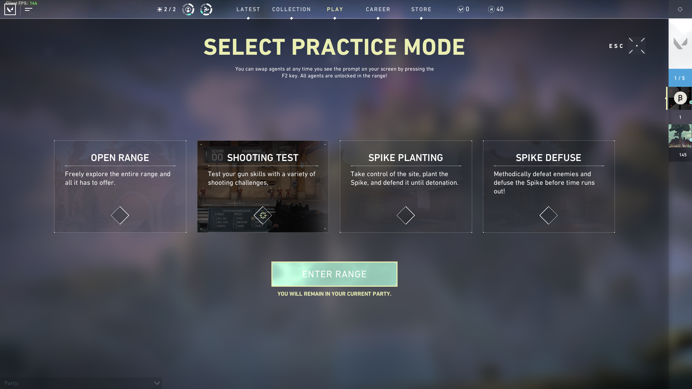
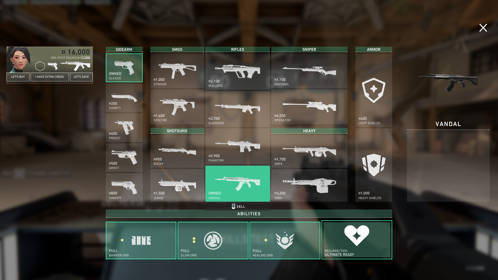
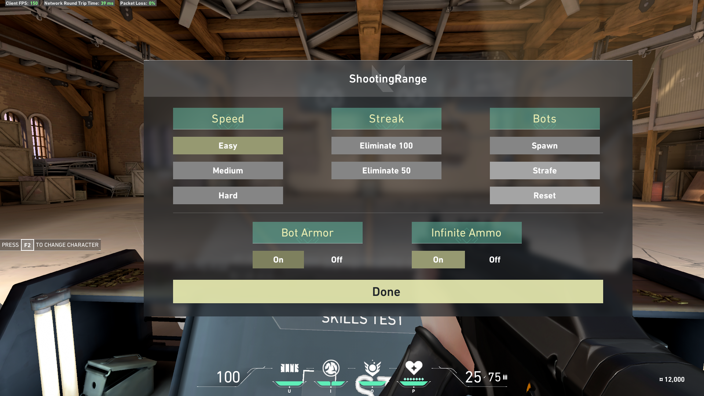
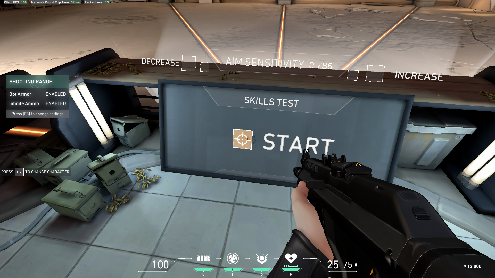
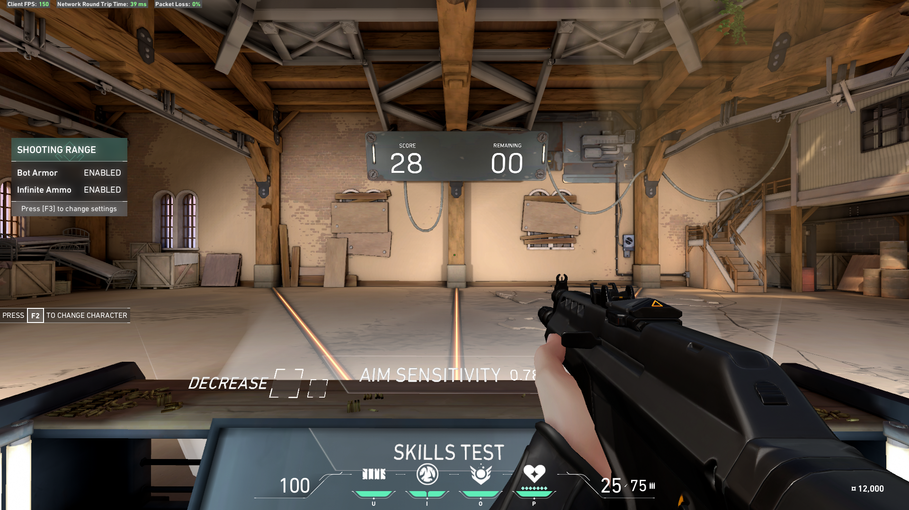
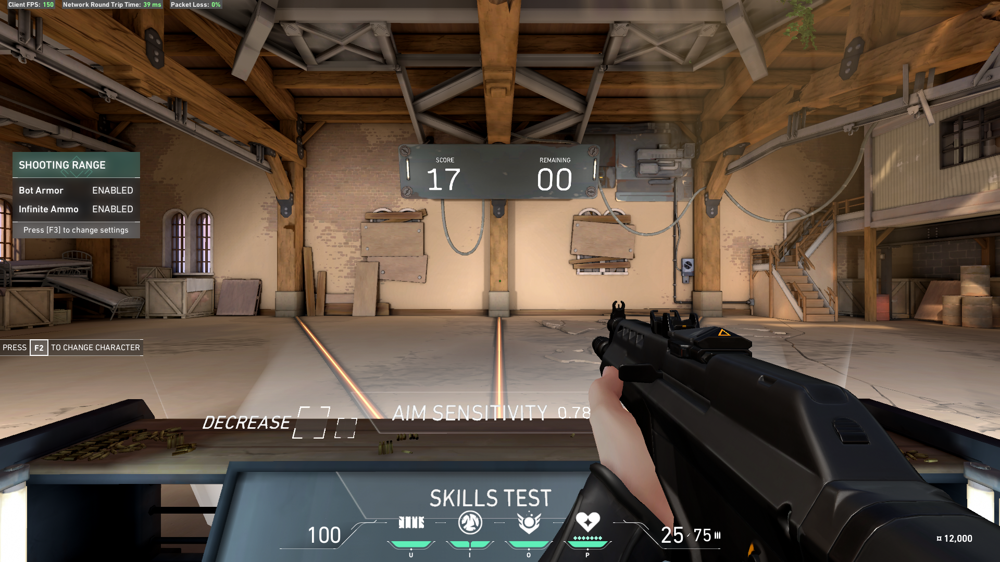

# valorant

## Training routine

This is a routine I try to do everytime and before I want to play a game. As a warming routine.

First you have to select the shooting test in the practice mode and enter the range.

  

To do this routine you have to choose the vandale since its damage is stable over range and it can one shot (in the head). You also have to put armor on bot to make sure you aim at heads! (F3 to go to range settings).

  
  

Here are the rules, they are quite simples, then you just have to start the range and follow this quite simple rules

  

Do NOT jump right away into hard speed. Respect your warming time and begin with Easy mode.

**Take note that you have to reposition your crosshair in the middle of the range every time!**

### Easy and Medium

You start with easy speed (F3).

In both easy and medium speeds, you have to "one tap" the dummies. It means you have to click once in the head.

- If your score is _greater than 20_, you can go to the **next level** (easy to medium, or medium to hard).
- If your score is _lesser than 10_, you have **to step down** the difficulty.
- If you are _in between_, **retry until you hit 20**.

  
  

### Hard

In hard speed I use some other rules because ... it's really hard for me right now.

Do not one tap. You can do some full if you need.

- If your score is _lesser than 10_ **TWICE IN A ROW**, you have **to step down** the difficulty and go back to medium rules.
- If your score is _greater or equal to 15_, you can **play** 🎉
